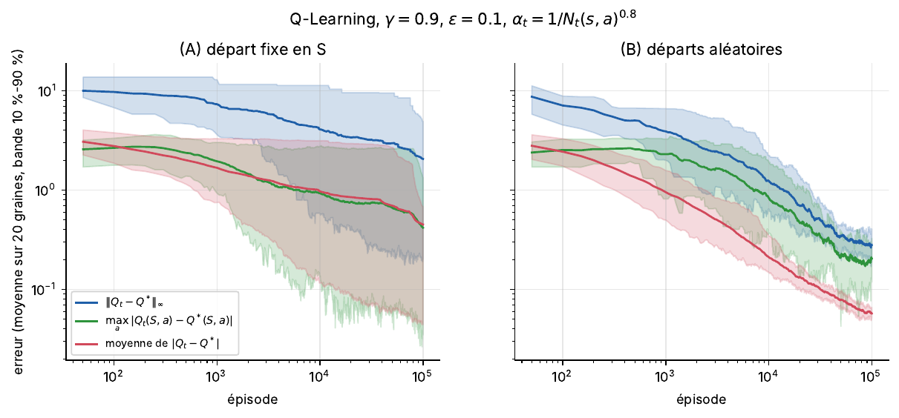

# Analyse mathématique de la convergence du Q-Learning dans les MDP finis

*Mathematical Analysis of Q-Learning Convergence in Finite Markov Decision Processes*

Projet personnel de mathématiques appliquées de Zakariae Boujham (2026). Il montre pourquoi le Q-Learning tabulaire converge vers la fonction d'action-valeur optimale $Q^*$ dans un processus de décision markovien fini, puis confronte la théorie à des expériences numériques.

La chaîne logique étudiée :

```
chaînes de Markov → MDP → fonctions de valeur → équations de Bellman
→ opérateur de Bellman → contraction (rapport γ, norme infinie)
→ point fixe unique Q* (Banach) → Value Iteration → Q-Learning → Q_t → Q*
```

**Rapport complet (35 pages, français) :** [`report/report.pdf`](report/report.pdf)

## Résultats principaux

* L'opérateur d'optimalité de Bellman est une contraction de rapport γ en norme infinie ; le théorème de Banach donne l'existence et l'unicité de Q* et la convergence géométrique de Value Iteration (35 itérations ici pour une tolérance de 1e-8).
* Le Q-Learning est une version stochastique, asynchrone et sans modèle de cette itération : sa cible est un estimateur sans biais de (TQ)(s, a).
* Avec α = 1/N(s,a)^0.8 et des départs aléatoires, l'erreur ‖Q_t − Q*‖∞ passe de 7.10 (100 épisodes) à 0.28 (100 000 épisodes) en moyenne sur 20 graines, et la politique gloutonne devient optimale pour toutes les graines.
* Chaque hypothèse du théorème de convergence a été « cassée » séparément : pas constant → plancher de bruit, ε = 0 → apprentissage figé et politique parfois sous-optimale.



## Contenu

```
qlearning-mathematical-analysis/
├── README.md
├── requirements.txt
├── run_all.py                  # relance toutes les expériences + génère les nombres du rapport + tests
├── src/
│   ├── environment.py          # GridWorld 4x4 stochastique : P[s,a,s'], R[s,a,s'], reset(), step()
│   ├── value_iteration.py      # opérateurs T et T^pi, Value Iteration, évaluation exacte d'une politique
│   ├── q_learning.py           # Q-Learning tabulaire, taux d'apprentissage (constant, 1/N, 1/N^w)
│   ├── policies.py             # greedy, epsilon-greedy
│   ├── markov_chain.py         # chaînes de Markov : puissances, simulation, loi stationnaire
│   └── utils.py                # norme infinie, sauvegardes, dessin des grilles et politiques
├── experiments/
│   ├── common.py               # exécution multi-graines en parallèle
│   ├── markov_chain_example.py # P^2, P^3, vérification Monte-Carlo
│   ├── value_iteration_experiment.py  # Q*, vitesse de VI, contraction, optimalité, bornes
│   ├── main_qlearning.py       # ||Q_t - Q*||_inf, départ fixe vs départs aléatoires (20 graines)
│   ├── gamma_experiment.py     # gamma ∈ {0.5, 0.8, 0.9, 0.95, 0.99}
│   ├── alpha_experiment.py     # alpha ∈ {0.1, 0.5, 0.9, 1/N, 1/N^0.8} + Robbins-Monro scalaire
│   └── epsilon_experiment.py   # epsilon ∈ {0, 0.05, 0.1, 0.3} + initialisation pessimiste
├── tests/test_core.py          # tests reliant le code aux résultats théoriques
├── results/
│   ├── figures/                # toutes les figures (PDF)
│   └── data/                   # résultats bruts (JSON, NPZ)
└── report/
    ├── report.tex              # rapport (LaTeX, français)
    ├── sections/               # sections du rapport
    ├── make_results.py         # écrit generated/results.tex à partir de results/data
    ├── generated/results.tex   # macros des nombres et tableaux (généré)
    └── report.pdf              # rapport compilé
```

## Environnement étudié

Grille 4×4, départ S = (0,0), objectif G = (3,3) absorbant, obstacles en (1,1) et (2,2), donc 14 états et 4 actions. Dynamique glissante : l'action demandée est exécutée avec probabilité 0.8, sinon l'agent part perpendiculairement (0.1 de chaque côté). Récompenses : +10 en arrivant sur G, −5 en cas de collision (bord ou obstacle, l'agent reste sur place), −1 sinon.

## Reproduire

```bash
pip install -r requirements.txt
python run_all.py                 # ~15 min sur 2 cœurs ; graines fixées, résultats identiques à chaque exécution
cd report && pdflatex report.tex && pdflatex report.tex
```

Chaque script de `experiments/` peut aussi être lancé seul. Le Q-Learning n'utilise jamais `env.P` ni `env.R` pour apprendre : seulement `env.reset()` et `env.step(a)`. Le modèle sert uniquement à mesurer l'erreur par rapport à $Q^*$ (calculé par Value Iteration) et à évaluer exactement les politiques apprises.

## Règle de rigueur

Aucun nombre du rapport n'est écrit à la main : `report/make_results.py` lit les fichiers de `results/data/` et génère les macros LaTeX utilisées dans le texte et les tableaux.

## Références principales

* C. Watkins, P. Dayan. Q-learning. *Machine Learning*, 8:279–292, 1992.
* T. Jaakkola, M. Jordan, S. Singh. On the convergence of stochastic iterative dynamic programming algorithms. *Neural Computation*, 6(6):1185–1201, 1994.
* J. Tsitsiklis. Asynchronous stochastic approximation and Q-learning. *Machine Learning*, 16:185–202, 1994.
* H. Robbins, S. Monro. A stochastic approximation method. *Ann. Math. Statist.*, 22(3):400–407, 1951.
* M. Puterman. *Markov Decision Processes*. Wiley, 1994.
* R. Sutton, A. Barto. *Reinforcement Learning: An Introduction*, 2e éd. MIT Press, 2018.
